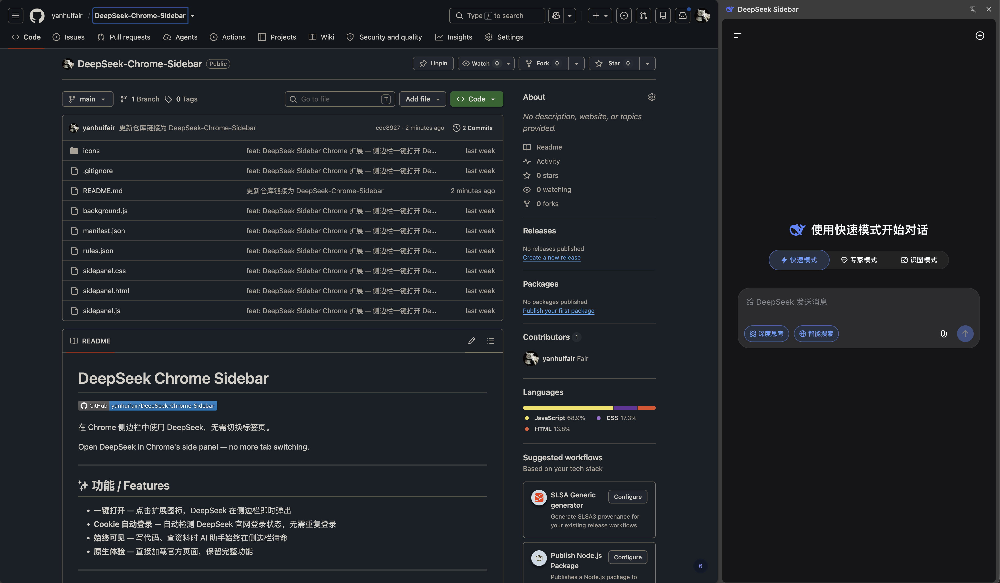

# DeepSeek Chrome Sidebar

[中文文档](README-zh.md)

[](https://github.com/yanhuifair/DeepSeek-Chrome-Sidebar)

Open DeepSeek in Chrome's side panel — no more tab switching.



---

## ✨ Features

- **One-click access** — Click the extension icon, DeepSeek pops up instantly in the sidebar
- **Auto login via cookie** — Detects DeepSeek login status automatically, no repeated login needed
- **Always visible** — Keep your AI assistant at your side while coding or researching
- **Native experience** — Loads the official page directly, preserving all features

---

## 📦 Installation

### Chrome Web Store (Recommended)

> Go to [Chrome Web Store](https://chrome.google.com/webstore) and search "DeepSeek Sidebar"

### Manual Installation (Developer Mode)

1. `git clone https://github.com/yanhuifair/DeepSeek-Chrome-Sidebar.git`
2. Open `chrome://extensions/`, enable "Developer mode" in the top right
3. Click "Load unpacked", select the project folder

---

## 🔒 Privacy

This extension does **NOT collect, store, or transmit** any user data. See [Privacy Policy](privacy-policy.html).

---

## 📋 Permissions

| Permission | Purpose |
|------|------|
| `sidePanel` | Display page in Chrome side panel |
| `cookies` | Only check login status on `chat.deepseek.com`, no other domains |
| `declarativeNetRequest` | Remove X-Frame-Options to allow embedding |

---

## 🛠 Tech Stack

- Chrome Extension Manifest V3
- Service Worker (background.js)
- Side Panel API
- Declarative Net Request

---

## 📁 Structure

```
├── manifest.json          # Extension config
├── background.js          # Service Worker (cookie detection + sidebar control)
├── sidepanel.html         # Side panel page
├── sidepanel.js           # Side panel logic
├── sidepanel.css          # Side panel styles
├── rules.json             # Net request rules
├── icons/                 # Extension icons
├── store-assets/          # Store assets (screenshots, copy)
└── privacy-policy.html    # Privacy policy
```
